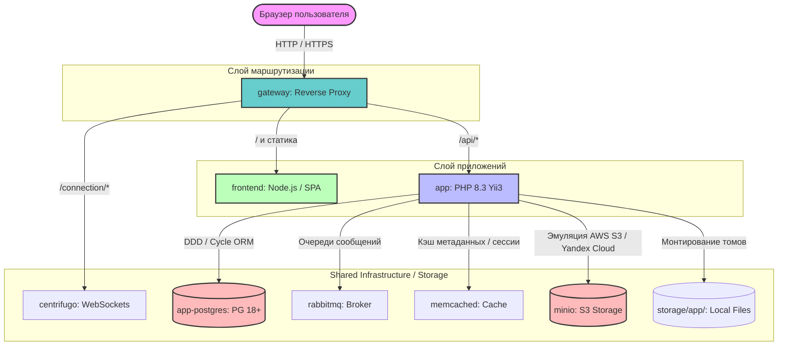

## 💡 Парадигма Infrastructure Shared Services (`common/`) & Storage

Для исключения дублирования кода (DRY) и стандартизации окружений внедрены следующие паттерны:

1. **Multi-stage PHP Builds**: В `common/php/` расположен единый `Dockerfile`. Сборка разделена на стадии (`target: development` с Xdebug, `target: production` с жестким opcache).
2. **Изолированный Слой Storage**: Папка `storage/` вынесена за пределы контейнеров и кода приложения.
    * Локальные файловые хранилища Yii3 маппятся из `storage/app/` в контейнер.
    * Для работы с объектным хранилищем в `dev` и `test` контурах разворачивается **MinIO** (данные пишутся в `storage/s3/`). В `prod` код приложения без изменений переключается на AWS S3 / Yandex Cloud через переменные окружения.
3. **Docker Compose Extends**: Общие инфраструктурные сервисы (RabbitMQ, Memcached, Centrifugo, MinIO) описываются один раз в `common/`, после чего наследуются (`extends`) в целевых `compose.yml`.
4. **Config Mounts (Read-Only)**: Конфигурационные файлы монтируются внутрь контейнеров в режиме `ro`.

---

## 📋 Таблица вызовов Makefile (Шпаргалка)

Управление проектом инкапсулировано в `Makefile`. Все команды автоматически прокидывают системные `UID` и `GID` текущего пользователя Linux, предотвращая конфликты прав (`root-owned files`) при генерации кэша, логов и медиа-файлов.


| Контекст | Команда (Target) | Вызываемые шаги / Логика | Назначение |
| :--- | :--- | :--- | :--- |
| **Старт** | `make init` | `docker-down-clear` $\rightarrow$ `storage-clear` $\rightarrow$ `app-clear` $\rightarrow$ `docker-pull` ... | **Первый запуск.** Полный холодный запуск проекта с нуля. |
| **Старт** | `make app-init` | `storage-permissions` $\rightarrow$ `app-permissions` $\rightarrow$ `app-deps-install` ... | Накатка окружения и прав внутри поднятого PHP-контейнера. |
| **Docker** | `make up` | `docker compose up --detach` | Быстрый старт контейнеров в фоновом режиме. |
| **Docker** | `make down` | `docker compose down --remove-orphans` | Корректная остановка контейнеров. |
| **Docker** | `make restart` | `make down` $\rightarrow$ `make up` | Перезапуск текущего окружения. |
| **Docker** | `make docker-down-clear` | `docker compose down --volumes --remove-orphans` | Остановка с **полным удалением всех DB & S3 Volumes**! |
| **Хранилище**| `make storage-clear` | `alpine:3.23 sh -c 'rm -rf storage/app/* storage/s3/*'` | Полная очистка локальных загрузок и локального S3 бакета. |
| **Хранилище**| `make storage-permissions`| `alpine:3.23 chmod -R 777 storage/` | Корректировка прав файлового хранилища для PHP-FPM / CLI. |
| **Yii3** | `make app-clear` | `alpine:3.23 sh -c 'rm -rf var/cache/* ...'` | Очистка кэша, логов и тестов Yii3 из-под root (внутри `/app`). |
| **Yii3** | `make app-deps-update` | `docker compose run --rm app-php-cli composer update` | Обновление зависимостей в `vendor/`. |
| **Yii3** | `make app-test` | `docker compose run --rm app-php-cli composer test` | Запуск Unit и Integration тестов Yii3. |
| **БД** | `make app-wait-db` | `wait-for-it app-postgres:5432 -t 30` | Блокирующий шаг. Ожидание готовности СУБД перед миграциями. |
| **CI/CD** | `make validate-jenkins`| `curl ... https://alt-dev.ru...` | Отправка локального `Jenkinsfile` на валидацию в Jenkins API. |

---

## 🚀 Быстрый старт для разработчика

1. Склонируйте репозиторий.
2. Подготовьте локальный файл переменных:
   ```bash
   cp .env.example .env
   ```
3. Запустите полную сборку и инициализацию проекта:
   ```bash
   make init
   ```
4. Проект будет доступен локально через порты, настроенные в вашем `.env` (через `gateway`).

### 🔄 Схема сетевой архитектуры и взаимодействия сервисов

Вся маршрутизация трафика инкапсулирована внутри Docker-сети. Прямой доступ к сервисам приложения снаружи закрыт, коммуникация идет строго через единую точку входа — `gateway`.



---

### 🔍 Краткое пояснение архитектуры:

1. **Единый домен**: Браузер общается только с `gateway`. Это исключает проблемы с политикой безопасности **CORS** при запросах от фронтенда к бэкенду.
2. **Headless-подход**: `app` (Yii3) выступает исключительно как поставщик данных (API). Он изолирован от интерфейсной части, что позволяет независимо масштабировать или переписывать `frontend` без изменения бизнес-логики.
3. **Иммутабельность среды**: Все сервисы слоя `Infra` используют конфигурации из `infrastructure/docker/common/`, гарантируя идентичность локального окружения, тестового контура в CI/CD и Production-сервера.

---
